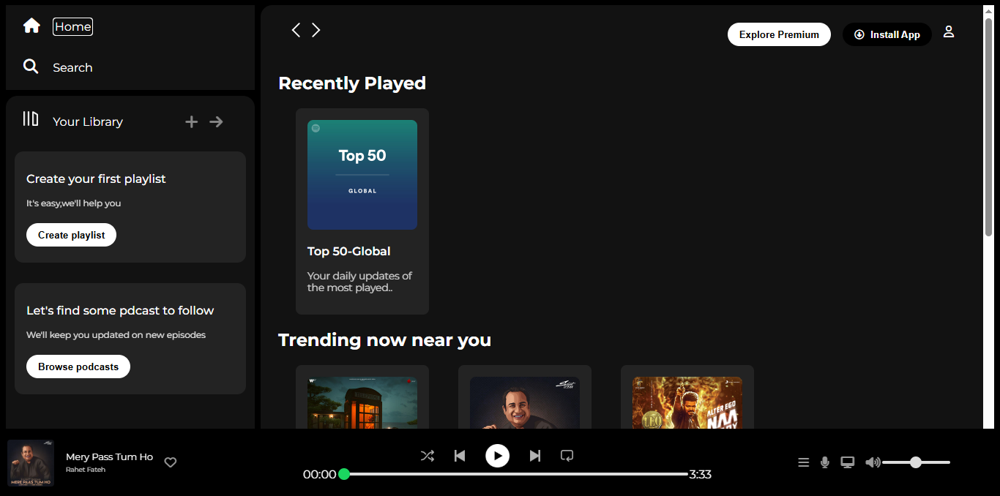
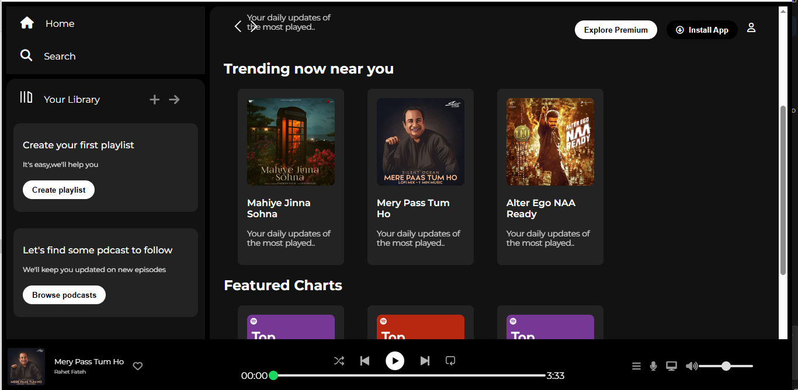

# Spotify Clone

This project is a simple Spotify Clone built with HTML and CSS.

## Project Structure
- `index.html`: Main HTML file for the app UI
- `style.css`: Stylesheet for the app
- `Assets/`: Folder containing images, icons, and other assets

## Features
- Responsive music player layout
- Styled to resemble Spotify's interface
- Static content (no backend or JavaScript functionality)

## Getting Started
1. Clone or download this repository.
2. Open `index.html` in your browser to view the app.

## Customization
- Replace images in the `Assets/` folder to personalize the look.
- Edit `index.html` and `style.css` to add more features or change the design.

## Screenshots

## License
This project is for educational purposes only and is not affiliated with Spotify.
